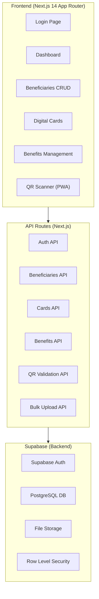
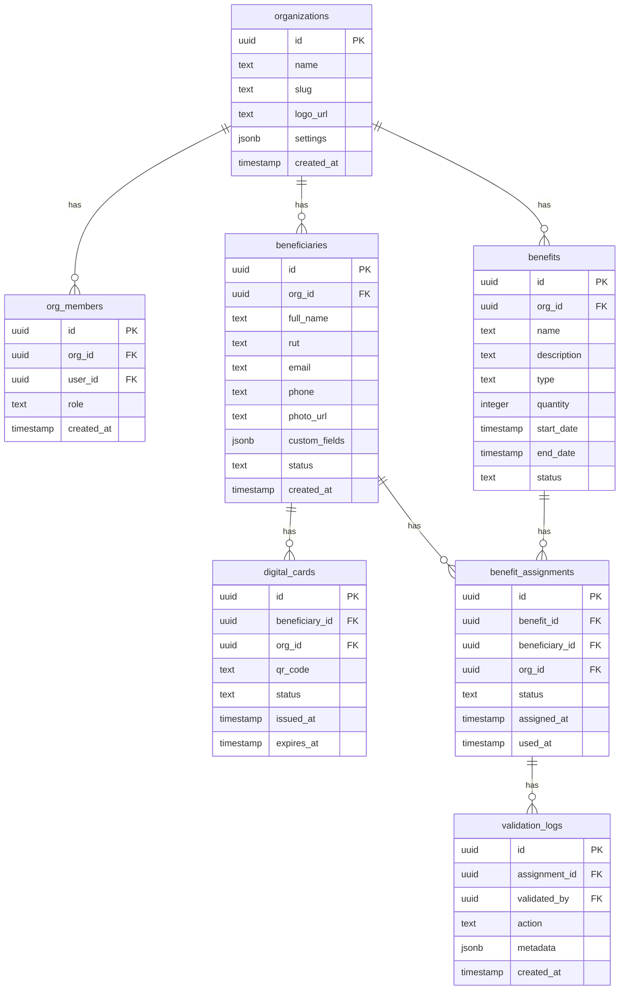

# 🎴 CardSocial - Plataforma SaaS de Tarjetas Digitales

## Arquitectura del Sistema

## Database Schema

## Tech Stack
| Layer | Technology |
|-------|-----------|
| Frontend | Next.js 14 (App Router) |
| Styling | TailwindCSS 3 |
| Auth | Supabase Auth |
| Database | Supabase PostgreSQL |
| Storage | Supabase Storage |
| QR Generation | `qrcode` npm package |
| QR Scanning | `html5-qrcode` |
| Charts | `recharts` |
| CSV Parsing | `papaparse` |
| PWA | `next-pwa` |

## Implementation Phases

### Phase 1: Foundation ✅
- [x] Next.js project setup
- [x] TailwindCSS configuration
- [x] Supabase client setup
- [x] Database schema
- [x] Auth system
- [x] Core layout components

### Phase 2: Core Features
- [x] Dashboard with analytics
- [x] Beneficiary CRUD
- [x] Digital card generation
- [x] QR code generation
- [x] Benefits management

### Phase 3: Advanced Features
- [x] QR Scanner (PWA camera)
- [x] Bulk CSV/Excel upload
- [x] Validation system
- [x] PWA manifest

### Phase 4: Polish
- [x] Mobile-first responsive design
- [x] Animations & transitions
- [x] Error handling
- [x] Loading states
